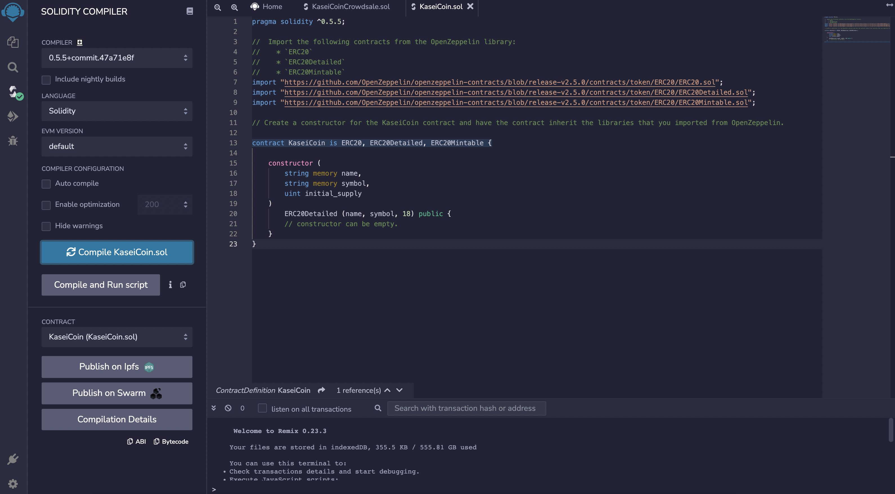
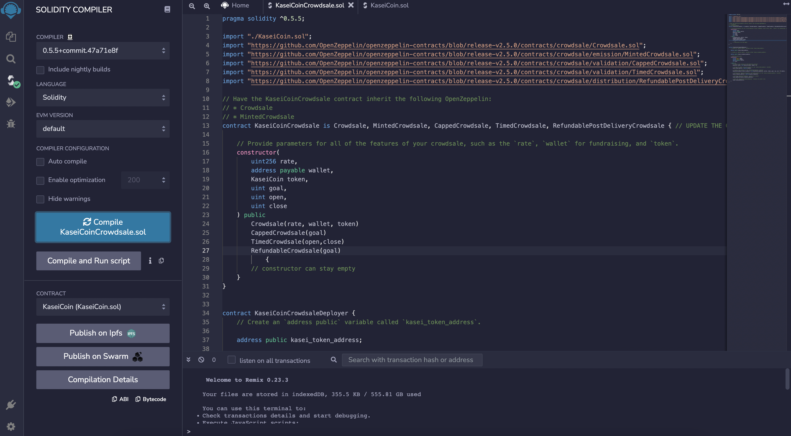
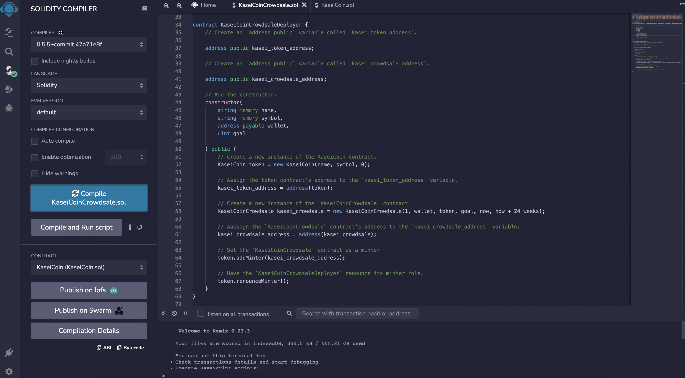

# 21_Tokenomics

### This project aims to develop a monetary system on blockchain technology by defining a new cryptocurrency called KaseiCoin. This coin will be a fungible token that is ERC-20 compliant and I will launch a Crowdsale that will allow users to converit their money to KaseiCoin.

---

## Technologies

This project leverages Solidity version 0.5.5 and the web version of the Remix IDE to build and test the smart contracts.

- [Remix IDE](https://remix.ethereum.org/#optimize=false&runs=200&evmVersion=null&version=soljson-v0.8.7+commit.e28d00a7.js) - is an open source application for developing, deploying, and administering smart contracts that run in Ethereum-based blockchains. We can use this IDE for the entire development cycle of smart contracts and as a playground for teaching and learning Ethereum. The Remix IDE is available in both web and desktop versions.

- [Ganache](https://trufflesuite.com/ganache/) - this was used to set up an Ethereum blockchan, which was used to quickly run and test the blockchain based app.

- [MetaMask](https://metamask.io/) - this is a crypto wallet and gaateway to blockchain apps.

- [OpenZeppelin](https://github.com/OpenZeppelin/openzeppelin-contracts) - this is a library for secure smart contract development.

---

## Evaluation Evidence

The crowdsale contract created manages the entire crowdsale process, allowing users to send ether to the contract and in return receive KAI, or KaseiCoin tokens. The contract mints the tokens automatically and distribute them to buyers in one transaction.

Below are the series of steps taken to create and test the contract:

1. Compiling of Kasei Coin token contract
   

2. Compiling of Kasei Coin Crowdsale contract
   

3. Compiling of Kasei Coin Crowdsale Deployer contract
   

To further view the successful functionality of the contract, please see the folder named `Evaluation_Evidence` for short recordings of deployment of the contract to a local blockchain by using Remix, MetaMask, and Ganache and its transactions.

- `KaseiCoinCrowdsale_Deployer.mov`: the deployment of KaseiCoinCrowdsaleDeployer
- `KaseiCoinCrowdsale_and_KaseiCoin.mov`: the deployment of KaseiCoinCrowdsale and KaseiCoin
- `Buying_Token_Checking_Balance.mov`: the functionality of buying tokens and checking the balance in associated accounts
- `totalSupply_weiRaised.mov`: checking the total supply of minted tokens and the amount of wei raised in crowdsale contract.
